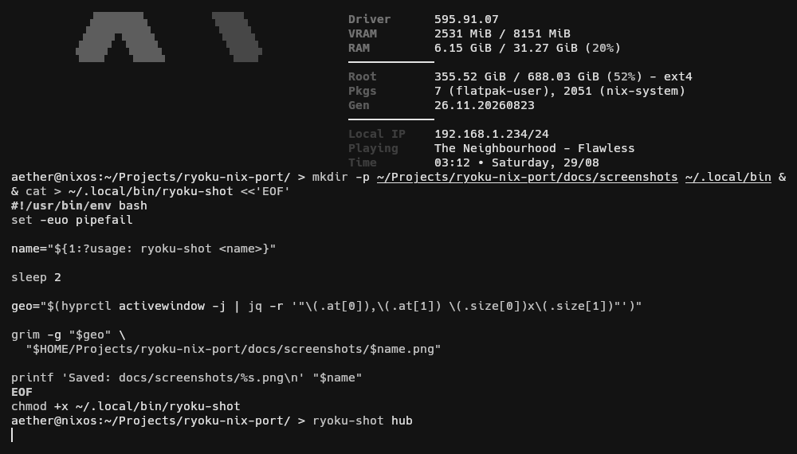
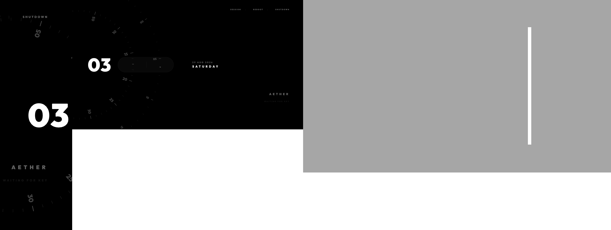

# Ryoku NixOS Port — Review Snapshot

> Private review copy of the Ryoku NixOS port.
>
> This repository is currently intended for upstream inspection rather than
> public distribution. The goal is to show how Ryoku has been adapted to NixOS,
> what required platform-specific handling, what currently works, and what still
> needs validation before the port is considered complete.

---

## Context

This work ports Ryoku to NixOS while keeping the upstream Ryoku codebase and
behaviour as intact as possible.

The general approach has been:

- keep Ryoku itself platform-neutral where practical;
- preserve existing Arch behaviour;
- keep NixOS-specific implementation primarily under `nix/`;
- use small compatibility hooks only where the application needs to know it is
  running on the NixOS integration;
- prefer declarative NixOS configuration over runtime mutation of `/etc`,
  `/usr`, PAM, systemd units, or other system-owned state.

Current upstream base:

```text
Branch:   unstable-dev
Revision: e57d11c09
Release:  0.45.7-beta.18
```

Initial NixOS port checkpoint:

```text
2957cf765 feat(nix): add initial Ryoku NixOS platform port
```

The Nix integration currently targets `nixos-unstable`.

---

## Current State

The port is functional as a daily desktop environment on the development
machine, but this should still be considered a review/testing branch rather
than a release-ready NixOS target.

### Working

- Ryoku shell startup and desktop integration
- NixOS flake/module integration
- Ryoku package/runtime environment
- Ryoku Hub
- RyoStore
- Ryo Motion packaging and core runtime
- recording integration with CPU fallback
- Matugen theme generation
- Kitty theme refresh
- Fastfetch integration
- qylock deployment
- qylock authentication
- stock lockscreen themes
- custom RyoStore lockscreen themes
- Hypridle integration
- pre-suspend locking
- SDDM Ryoku theme packaging
- dynamic SDDM theme bridge for RyoStore lock themes
- NixOS-safe handling of Hub authentication settings
- declarative PAM configuration

### Still Being Worked On / Validated

- Ryoku shell child-process/cgroup cleanup
- final RyoStore parity audit
- remaining Hub page parity checks
- remaining Ryo Motion UI workflow tests
- peripheral integration audit
- clean-machine / VM validation
- full fresh-session SDDM validation
- final NVIDIA suspend/resume validation

The NVIDIA suspend changes are already present in the next system generation,
but still require a reboot before the live kernel parameters can be validated.

---

## Screenshots

These are from the current NixOS development system rather than mock-ups.

### Desktop

<p align="center">
  
</p>

### Ryoku Hub

<p align="center">
  
</p>

### RyoStore

<p align="center">
  
</p>

### Ryo Motion

<p align="center">
  
</p>

### Lockscreen

<p align="center">
  
</p>

### Custom RyoStore Lockscreen

<p align="center">
  
</p>

---

## NixOS Layout

Most Nix-specific work lives under:

```text
nix/
├── modules/
├── packages/
└── ...
```

The intent is for this layer to adapt Ryoku to NixOS rather than maintain a
separate Nix-specific fork of the desktop.

The system is exposed through the flake and NixOS module so a host can consume
Ryoku roughly as:

```nix
inputs.ryoku = {
  url = "path:/path/to/ryoku";
  inputs.nixpkgs.follows = "nixpkgs";
};

# ...

modules = [
  ryoku.nixosModules.default
  {
    programs.ryoku.enable = true;
  }
];
```

---

## Platform Compatibility Approach

A small environment bridge is used where Ryoku needs different behaviour on
NixOS:

```text
RYOKU_NIX_SYSTEM_BRIDGE=1
```

This is used to avoid Arch-style imperative system changes while leaving the
existing behaviour available outside NixOS.

Examples include:

- system services being provided declaratively by NixOS;
- PAM files not being edited from the Hub;
- SDDM theme application being routed through a NixOS-owned helper;
- Hypridle being managed as a user systemd service;
- runtime dependencies being supplied by the Nix package/module rather than
  installed by shell scripts.

The aim is to keep these compatibility points small enough that upstream Ryoku
changes can still be merged without maintaining two separate implementations.

---

## Lockscreen / SDDM Notes

qylock is materialised into writable user state rather than attempting to write
into the Nix store.

Custom RyoStore themes are stored beneath the user's qylock theme directory and
can be selected normally from Ryoku.

For SDDM, the active theme is copied into Ryoku-owned mutable state under:

```text
/var/lib/ryoku/sddm-theme
```

The Nix-built SDDM theme entry points at that state. This allows RyoStore theme
selection to affect the greeter without modifying immutable Nix store paths.

The Hub's Arch-specific PAM mutation controls are disabled when the Nix bridge
is active because PAM is managed declaratively by NixOS.

---

## Ryo Motion / Recording Notes

Ryo Motion is packaged through Nix and exposed in the system environment.

Recording currently includes a CPU encoding fallback because the NVIDIA encode
path on the development system has an API compatibility issue. Core recording
and Studio recording have both produced valid clips, including cursor sidecar
data.

Some UI-triggered edit/open workflows still need final validation.

---

## Known Development Issue

The main active issue is process ownership around `ryoku-shell.service`.

During repeated shell restarts, child processes have remained associated with
the service and the unit has shown unusually high memory/CPU accounting.

This is being treated separately from the desktop functionality itself and is
the next major cleanup item.

---

## Suspend / NVIDIA

A suspend test exposed an NVIDIA resume failure which caused Hyprland and the
lockscreen session to terminate after resume.

The next NixOS generation contains the corresponding NVIDIA power-management
configuration, including preserved video memory, kernel suspend notifiers, and
a temporary backing-file location.

That generation has been built successfully but has not yet been activated by
a reboot, so the suspend fix should currently be considered **pending live
validation** rather than confirmed.

---

## Upstream Intent

This repository is not intended to become an independently diverging Ryoku
fork.

If the NixOS work is accepted upstream, the preferred long-term shape would be
for the Nix implementation to remain alongside Ryoku itself, with the NixOS
platform layer maintained separately from normal application development.

That should allow normal upstream Ryoku releases to be followed closely without
having to repeatedly re-port the desktop.

A future Ryoku NixOS ISO can be built on top of this work once the desktop port
itself is stable.

---

## Review Focus

The areas most useful to review at this stage are:

1. whether the separation between upstream Ryoku code and `nix/` is appropriate;
2. whether the small Nix compatibility hooks are acceptable upstream;
3. whether any of the Arch-specific behaviour should be abstracted differently;
4. whether the current module/package structure fits how Ryoku should support
   NixOS long-term;
5. any areas that should be changed before this is prepared for upstream
   integration.

This repository can be cleaned, rebased, or reorganised after review depending
on how the NixOS support should ultimately live upstream.
