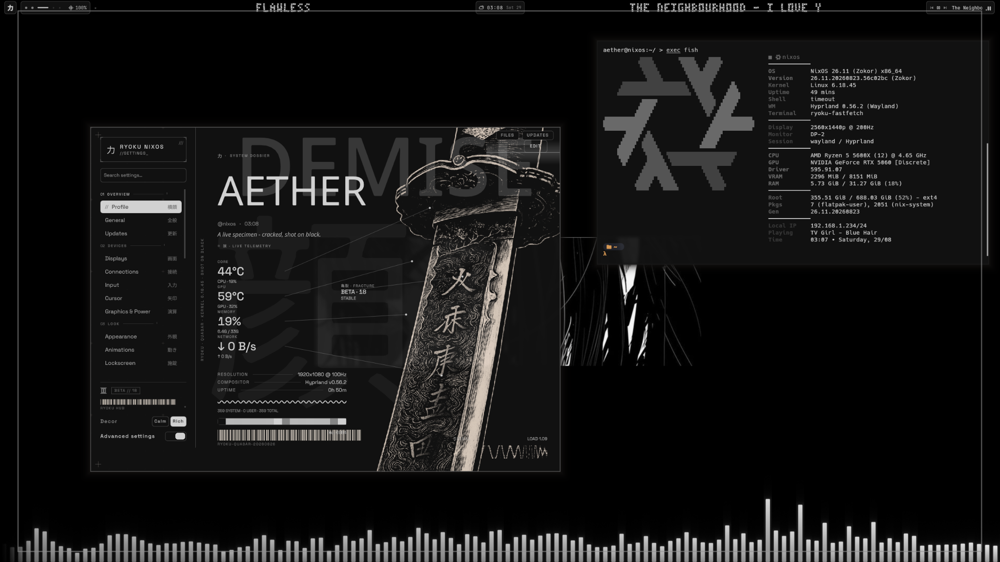
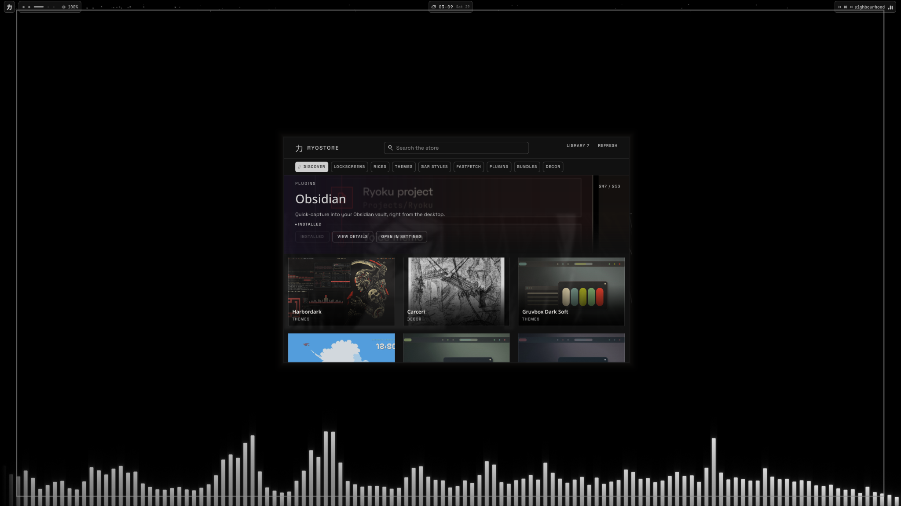
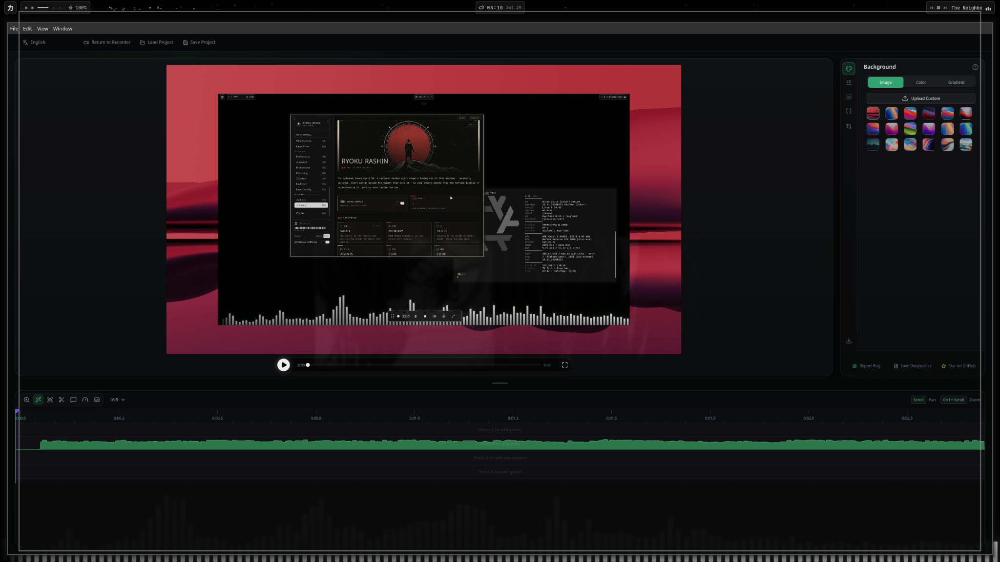
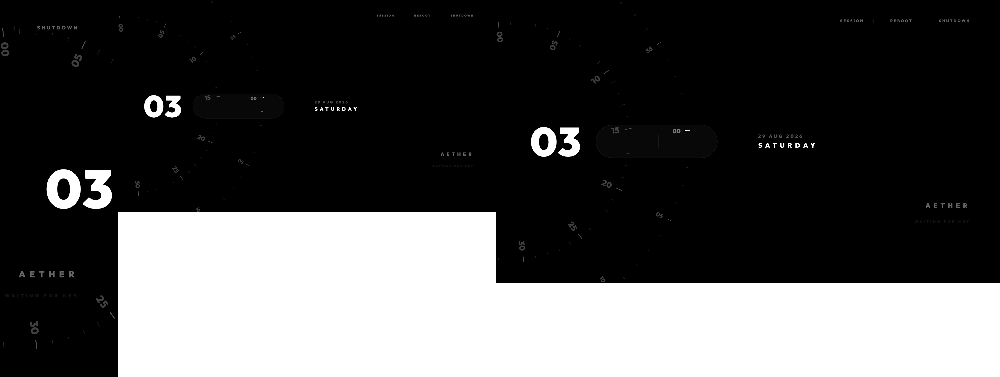

# Ryoku NixOS Port

> Private repo for the NixOS port of Ryoku.


## Overview

The goal is to support Ryoku natively on NixOS while keeping upstream behaviour
intact and avoiding a separate fork. Updates to the Nix version will probably come between 1-7 days of an arch update upstream apart from small things like widgets or a new wallpaper then itd be instant just to keep it stable and stop the updater trying to pull aur packages or pacman. 

Most NixOS specific implementation lives under `/etc/nixos/`. Small compatibility
hooks are only used where Ryoku needs different behavior on an immutable
declarative system.

Current upstream base:
```text
Upstream branch:   unstable-dev
Upstream revision: e57d11c09
Ryoku release:     0.45.7-beta.18
NixOS channel:     nixos-unstable
```

---

## Port Status

### Core

- [x] Nix flake integration
- [x] NixOS module
- [x] Ryoku package/runtime environment
- [x] Ryoku shell startup
- [x] Hyprland desktop integration
- [x] Ryoku Hub
- [x] RyoStore
- [x] Fastfetch integration
- [x] Matugen integration
- [x] Kitty theming with Matugen
- [x] Fastfetch working with Matugen
- [x] fish configs
- [x] zsh configs
- [x] Ryostore working and installing correctly
- [x] Rashin implimentation  

### Lockscreen / Session

- [x] qylock deployment
- [x] qylock password authentication
- [x] stock lockscreen themes
- [x] custom RyoStore lockscreen themes
- [x] Hypridle service
- [x] pre-suspend locking
- [x] SDDM Ryoku theme
- [x] dynamic RyoStore → SDDM theme bridge
- [x] declarative PAM handling
- [x] disable Arch PAM mutation controls on NixOS
- [x] fresh-session SDDM validation
- [x] final NVIDIA suspend/resume validation

### Ryo Motion / Recording

- [x] Ryo Motion Nix package
- [x] application launch/runtime
- [x] recording integration
- [x] Studio recording
- [x] cursor sidecar generation
- [x] CPU encoding fallback
- [x] UI-triggered edit/open tests

### Remaining

- [ ] fix `ryoku-shell.service` child-process/cgroup leak
- [ ] final RyoStore parity audit
- [ ] final Hub page parity audit
- [ ] peripheral integration audit
- [ ] fresh install test and VM test
- [ ] final upstream compatibility
- [ ] Creating some Nix specific fastfetch configs for Ryostore as theyre all Arch based
- [ ] Adding [Chroma](https://github.com/Aetherelic/chroma-shell) as a rice add on in the ryoku store [OPTIONAL] 

---

## Screenshots

### Desktop

<p align="center">
  
</p>

### RyoStore

<p align="center">
  
</p>

### Ryo Motion

<p align="center">
  
</p>

### Lockscreen

<p align="center">
  

---

## NixOS Structure

```text
nix/
├── modules/
├── packages/
└── ...
```

The Nix layer adapts Ryoku to NixOS rather than replacing or duplicating
upstream functionality.

Where platform-specific behaviour is required, Ryoku can detect:

```text
RYOKU_NIX_SYSTEM_BRIDGE=1
```

This currently handles cases such as:

- systemd services being managed declaratively;
- PAM remaining owned by NixOS;
- SDDM theme changes going through a Nix-owned helper;
- Hypridle being provided as a user systemd service;
- dependencies being supplied by Nix rather than installer scripts.

Existing non-Nix behaviour remains available outside the bridge.

---

## Notable NixOS Adaptations

### qylock / SDDM

Writable lockscreen themes are kept in normal user state rather than the Nix
store.

The currently selected SDDM theme is materialised under:

```text
/var/lib/ryoku/sddm-theme
```

This allows RyoStore themes to affect SDDM without attempting to modify
immutable Nix store paths.

### PAM

Ryoku's Arch-side PAM mutation controls are not allowed to modify `/etc/pam.d`
when the Nix bridge is active.

Authentication remains declaratively managed by NixOS.

### Recording

Ryo Motion is packaged natively through Nix.

The current development machine also uses a CPU recording fallback because its
NVIDIA encode path has an API compatibility issue.

---

## Known Issues

### `ryoku-shell.service`

Repeated shell restarts can leave child processes associated with the service,
causing excessive cgroup memory/CPU accounting.

This is the main final issue.

### NVIDIA suspend/resume

A previous suspend test exposed an NVIDIA resume failure that terminated
Hyprland after resume causing a Hyprland crash and having to use TTY to fix

The current nix generation already contains the required NVIDIA power-management
changes and seem to work, I wont know till I test it on my spare laptop which has a nvidia GPU

Status: **pending validation**, not confirmed fixed.

---

## Upstream Direction

This repository is not intended to become a permanently separate Ryoku fork.

If the port is accepted, the preferred structure is:

```text
Ryoku
├── ryoku/       # The actual project for Arch and Cachy
└── nix/         # NixOS implementation which I maintain 
```

The intention is for the NixOS version to follow normal Ryoku releases closely,
with a possible week delay between versions to make sure it will work properly with Nix 

A Ryoku NixOS ISO can be built on top of this the desktop port itself is merged in but will take a few months to complete probably around 2/3 months as ive only done it once before with a custom Fedora iso

---

## Review

The main things worth reviewing are:

- [ ] NixOS module/package structure
- [ ] separation between upstream code and `nix/`
- [ ] Nix compatibility hooks
- [ ] handling of Arch-specific imperative behaviour
- [ ] suitability for eventual upstream integration

The structure can be cleaned, rebased, or reorganised after review depending on
how NixOS support should live upstream.
